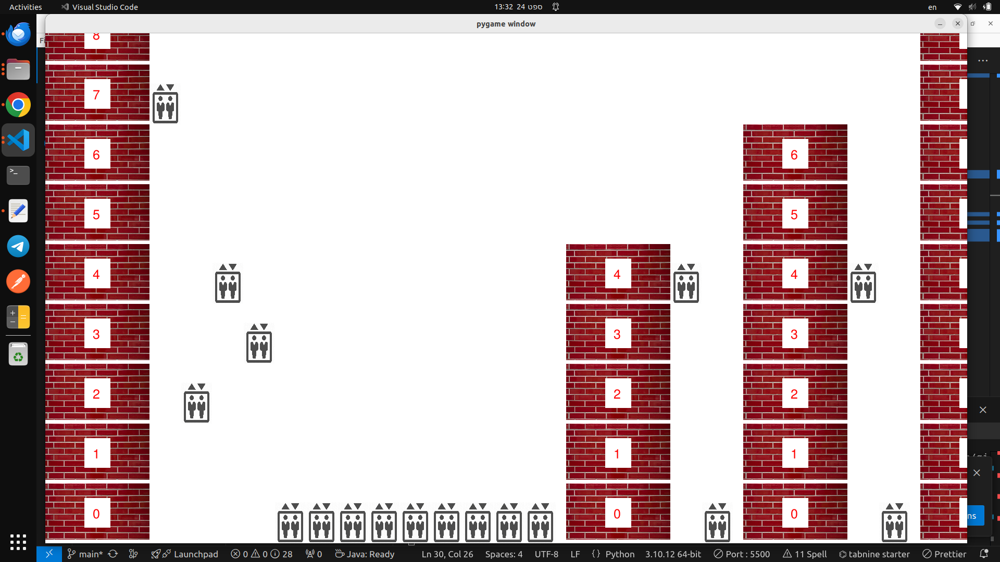

# Elevator Management System

This is an interactive elevator management system simulation built using Python and Pygame. It allows for a dynamic visualization of elevators moving between multiple floors in various buildings. The project demonstrates efficient handling of elevator movements, user input, and collision detection using the Pygame library.

## Features
- Multiple buildings with varying number of floors and elevators.
- Real-time management of elevator movements.
- Smooth scrolling and zooming for easy navigation.
- User interaction for calling elevators to specific floors.
- Visual and audio feedback for elevator arrival.


## Running the Simulation
To run the simulation, use the following command:
```bash
python main.py
```

## Directory Structure
```
project_root/
│
├── README.md               # Project documentation
├── src/                    # Source code for the simulation
│   ├── main.py             # Entry point for the game
│   ├── Elevator.py         # Elevator class logic
│   ├── Floor.py            # Floor class logic
│   ├── Building.py         # Building class managing multiple floors and elevators
├── assets/                 # Contains all graphical and sound assets
│   ├── graphics/           # Images used in the simulation
│   │   ├── elevator.png
│   │   ├── floor.jpg
│   └── sounds/             # Sound effects used in the simulation
│       ├── ding.mp3
```

## Screenshots


### Game Play


### Elevator Movement


## Future Improvements
- Add more customizable building layouts.
- Implement a scheduling algorithm for optimal elevator dispatch.
- Add a graphical user interface (GUI) for user settings and configurations.
